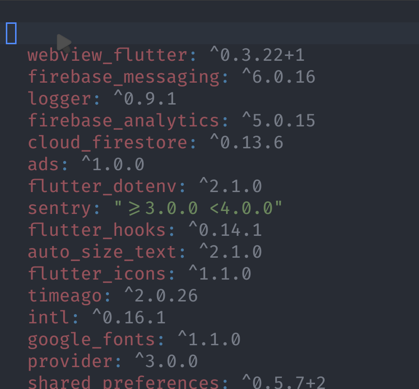
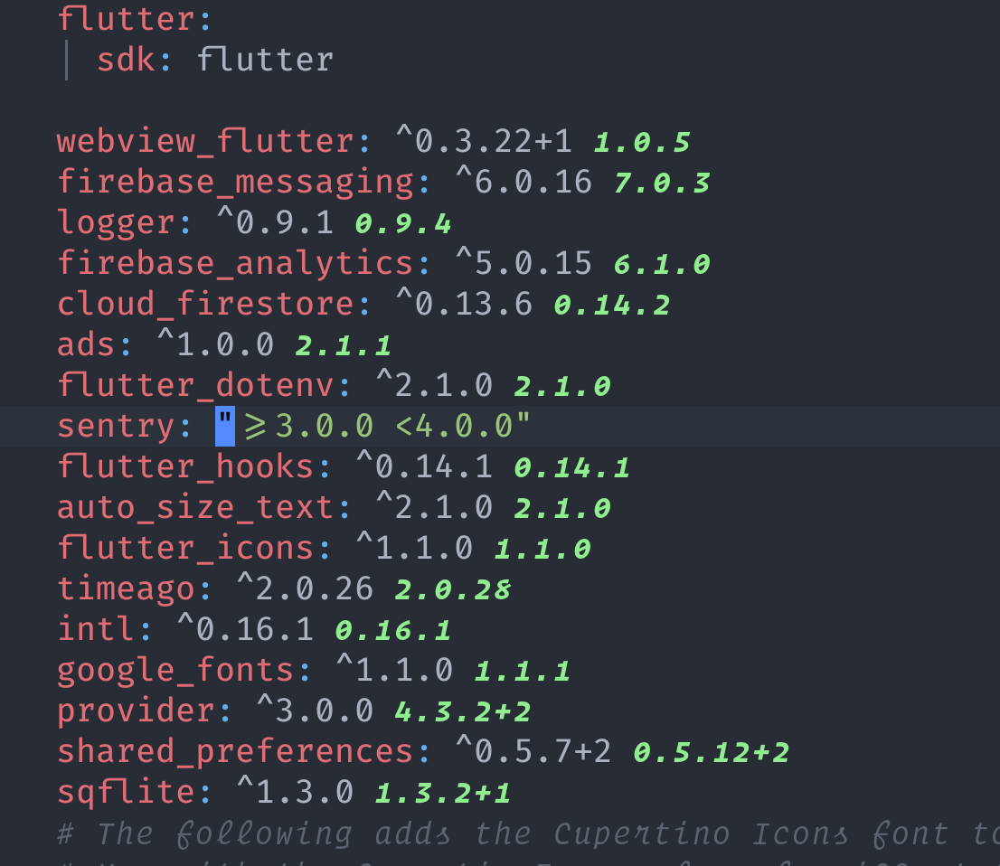
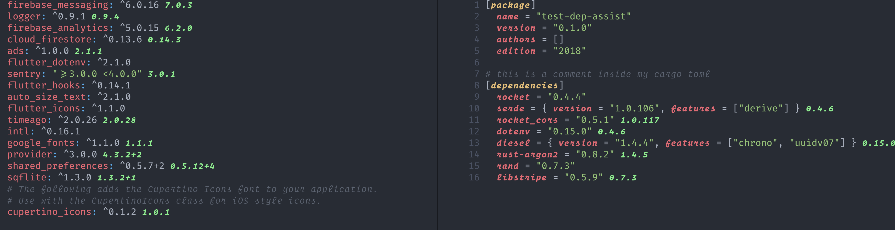

# Dependency-assist.nvim

Inspired by [pubspec assist](https://github.com/jeroen-meijer/pubspec-assist) a vscode dart plugin for getting version information for packages,
and by [vim-crates](https://github.com/mhinz/vim-crates), a vim plugin for visualising dependency versions.

Dependency assist is a neovim plugin written in lua, which is designed to help you find out which dependencies
are up to date and add new ones to your dependency file.

status: _Alpha_



**Dependency versions using virtual text**



### Supported languages

- Dart
- Rust (not 100% complete yet)



## Requirements

- **Nightly Neovim**

## Installation

```
Plug 'akinsho/dependency-assist.nvim'
```

Then in your `init.vim` somewhere after loading the plugin call

```vim
lua << EOF
  require'dependency_assist'.setup{}
EOF
```

## Usage

### `AddDependency/AddDevDependency`

These commands are buffer specific and only added within a supported file. For now this is any `dart` file or a `pubspec.yaml`.

This plugin works by showing you the current version of a dependency _if_ it differs from the version you have.

It also provides `AddDependency` and `AddDevDependency` commands within a supported filetype.
These commands open an input buffer which on hitting `Enter` is used to search `pub.dev` for matching packages.

It then returns a list of matches and on selecting them they will be added to your `devDependencies` or your `dependencies`
depending on what you selected.

### `UpdateDependencyLine`

Whilst inside a dependency file (`pubspec.yaml` for now) whilst on a line where there is a new version
available `UpdateDependencyLine` will swap the current version for the latest.

## Goals

This plugin was designed to be extensible 🤞. Hopefully adding a module for other compatible languages shouldn't be too
much work but I haven't tested this out by integrating another example yet.

This won't scale to all languages, and tbh I'm going to focus my energy on languages I use. If you are interested in contributing a
module for the language you use, open an issue.

### Dart

- [x] Parse `pubspec.yaml` and show versions using virtual text
- [x] insert specifically into `devDependencies` or standard dependencies
- [x] search for multiple packages
- [ ] review dependency versions

### Rust

- [ ] Implement version update per line
- [ ] Handle version virtual text for different package formats
