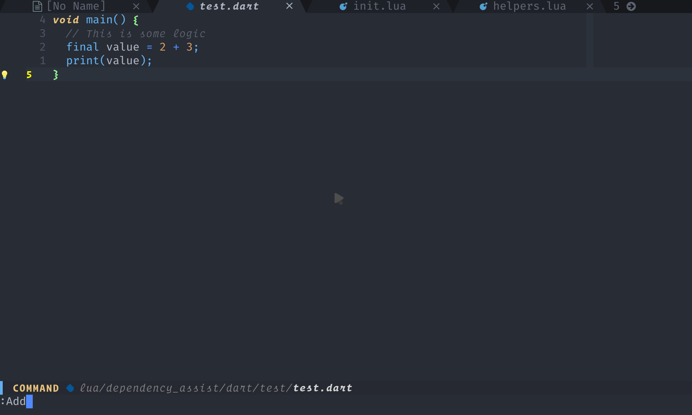

# Dependency-assist.nvim

Inspired by [pubspec assist](https://github.com/jeroen-meijer/pubspec-assist) a vscode dart plugin for getting version information for packages.
Dependency assist is a neovim plugin written in lua, which provides similar functionality.

**Dependency versions using virtual text**

## ⚠ NOTE

This plugin is a WIP please use it at your own risk, but be warned
I haven't finished building it yet.

## TODO

#### General

- [ ] Improve error handling

#### Dart

- [x] Parse `pubspec.yaml` and show versions using virtual text
- [x] insert specifically into `devDependencies` or standard dependencies
- [ ] search for multiple packages

#### Rust

- [ ] Implement `formatter`, `api` etc. (aka _everything_)
